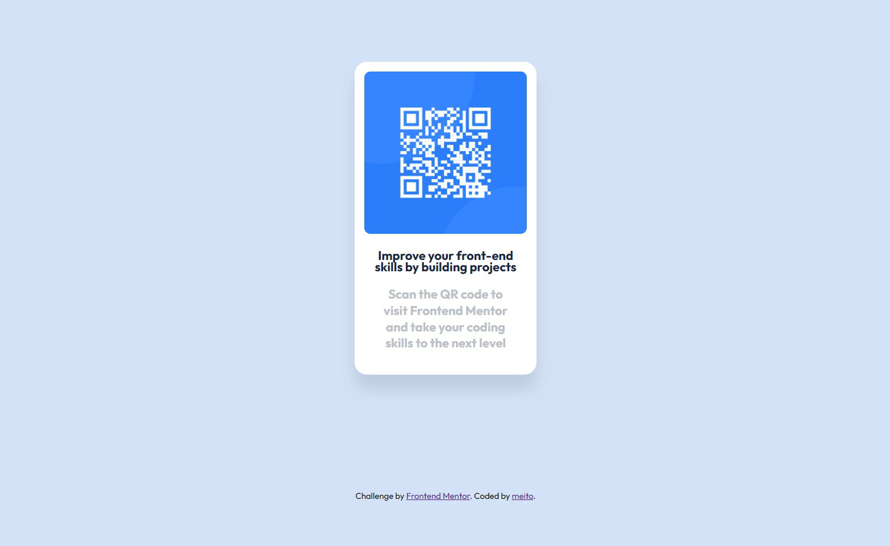

# Frontend Mentor - QR code component solution

This is a solution to the [QR code component challenge on Frontend Mentor](https://www.frontendmentor.io/challenges/qr-code-component-iux_sIO_H). Frontend Mentor challenges help you improve your coding skills by building realistic projects.

## Содержание

- [Ссылки](#links)
- [Автор](#author)

## Ссылки

- [Решение](https://github.com/Me1to/challenge/tree/main/qr-code-component-main1)
- [Задание](https://www.frontendmentor.io/challenges/qr-code-component-iux_sIO_H)

## Автор
- Github - [me1to](https://github.com/Me1to)